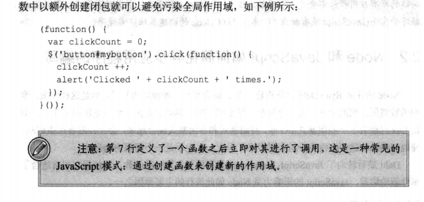
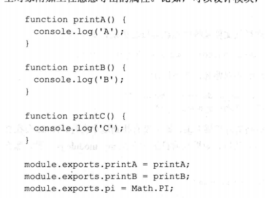
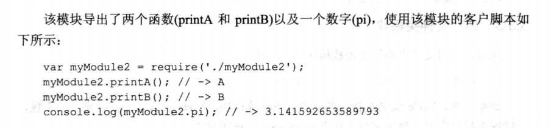
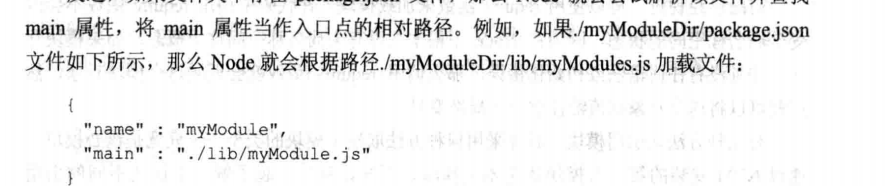
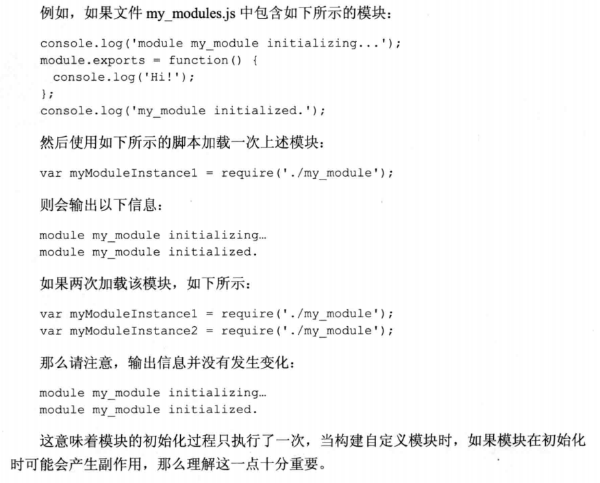
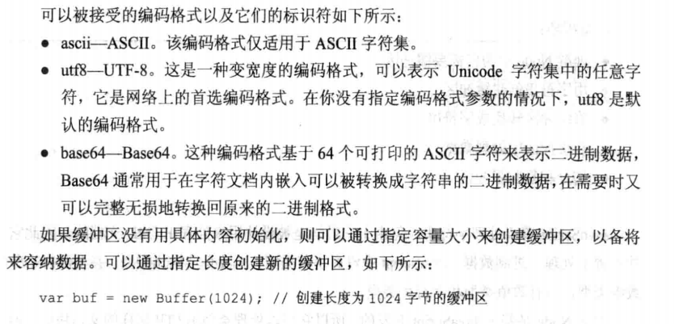
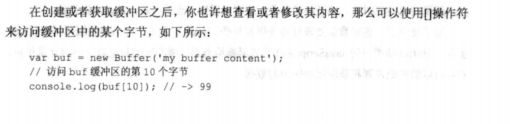
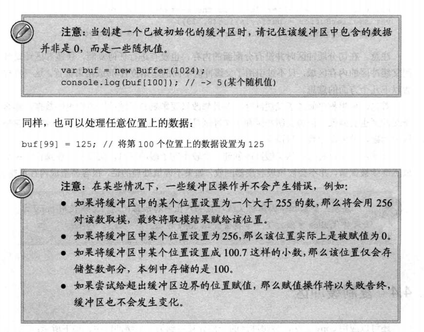
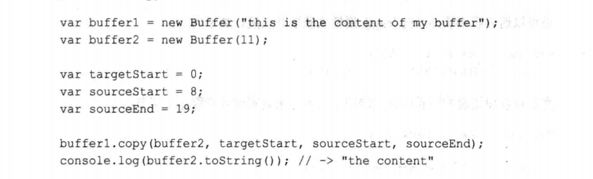

# Node.js高级编程

## 第一章：Node简介

	Node：一个搭建在Chrome JavaScript运行时上的平台，用于构建高速、可伸缩的网络程序  

## 第二章：Node简介

### 事件驱动编程风格介绍

​	类似于可以异步操作，这种以定义当兴趣事件发生时由系统调用的函数来取代返回值的编程风格被称为事件驱动编程或者异步编程，这意味着当前进程在处理I/O操作时不会发生阻塞。

### 闭包

​	继承并访问它自身被声明的那个作用域里的变量。当你将一个回调函数作为参数传递给另外一个I/O操作的函数时候，回调函数稍后会被调用，在被调用时，回调函数会记住它自身声明时所在的上下文，并且可以访问该上下文及其父上下文时的所有变量。

​	详情看：js高级程序设计

可以将代码包装在函数中以额外创建闭包就可以避免污染全局作用域。

也就是立即执行函数



### 闭包如何辅助异步编程

​	在进行事件驱动编程时，从定义事件发生时执行的代码开始，然后将代码放入一个函数当中，最后将函数作为一个参数进行传递以备稍后调用。

​	应用闭包模式：

- 可以通过状态变量传递给函数而不必维护它就能进行事件驱动编程
- js的闭包会为你维护状态变量

------

## 第三章：加载模块

​	Node为服务器端的js制定了一些规范，并实现了commonjs模块标准。在这个标准中， 每个模块都拥有一个上下文，将该模块和其他模块隔离开来，这意味着模块不会污染全局作用域-因为根本没有全局作用域。（模块化思想）

### 理解Node如何加载模块

​	在Node中既可以用文件路径也可以用名称来引用模块，除非是核心模块，否则用名称引用的模块最终都会被映射为一个文件路径。

```
var module = require("module_name");
```

​	上面的代码会导入一个核心模块或者由NPM安装的模块，require函数会返回一个对象，该对象表示模块地外暴露的jsAPI。根据模块的不同，该对象可能是任意的js值--可以是一个函数，也可以是一个对象。

### 导出模块

​	在Node中，CmmonJS系统是文件之间共享对象或函数的唯一方式，对于足够复杂的应用程序中，你应该将一些类，对象或者函数划分为定义良好的可重用模块。

​	Node中，模块和文件是一 一对应的。

```js
// 形式1
module.exports = 需要导出的内容(形式不限)
// 形式2
module.exports.name1 = 需要导出的内容(形式不限)
module.exports.name2 = 需要导出的内容(形式不限)
...
```





### 加载模块

​	可以使用require函数来加载模块，在代码中调用require函数不会改变全局名称空间的状态，因为在Node中没有全局名称空间这个概念。

​	对于核心模块，npm安装的第三方模块，本地模块有不同的引用方法。

#### 加载核心模块

​	核心模块：二进制形式发布的模块，只能通过模块名引用。

```js
var http = require('http');
```

#### 加载文件模块

​	可通过绝对路径从文件系统中加载非核心模块。

```js
// 可省略文件扩展名，当然也可以加上
// 绝对路径
var mymodule = require('/home/pedro/my_modules/my_module');
// 可基于当前文件的相对路径
var myModule = require('../my_modules/my_module');
```

#### 加载文件夹模块

```js
var mymodule  = require('./myModuleDir');
```

​	Node会在指定文件夹下查找模块，Node会假定该文件夹是一个包，并试图查找包定义。包定义包含在名为package.json的文件中。

​	如果不存在package.json中，那么包的入口点会假定为默认值index.js，就本例而言，Node会在路径./myModuleDire/index.js下查找文件。

​	如果存在package.json的文件，会查找里面main属性并当作入口点的相对路径。

​	

#### node_module文件夹加载

​	Node会在当前文件夹node_module下查找该模块

```js
var mymodule = require('myModule.js');
```

​	该特性具备不断向上查找node_module的特性。

#### 缓存模块

​	模块在首次加载时会被缓存起来，这意味着如果模块名能被解析为相同的文件名，那么每次调用`require('mymodule')`都会确切地返回同一模块。

​	

------

------

## 应用缓冲区、编码和解码二进制

命令行使用`node yourname.js`运行js代码。

​	js没有字节类型，也没有结构化类型，甚至没有数组类型，不方便处理数据库通信、操作图像以及上传文件。

​	Node引入一个二进制缓冲区实现，该实现以Buffer伪类中的jsAPI形式暴露给外界。缓冲区的长度以字节为计量单位，并且可以随机地设置和获取缓冲区的数据。


### 创建缓冲区

​	可使用UTF-8编码格式的字符串来创建缓冲区。

```js
var buf = new Buffer('Hello World');
或者
var buf = new Buffer('Hello World','编码格式名0');
```



### 在缓冲区中获取和设置数据





​	也就是可以像数组一样使用，长度，下标索引等。

### 切分缓冲区

​	一旦创建或获取一个缓冲区，也许需要将此缓冲区的一部分提取出来，可以通过指定起始位置和结束位置来切分缓冲区，从而创建一个更小的缓冲区。

```js
var buffer = new Buffer("this is buffer");
var smallerBuffer = buffer.slice(8,19);
```

​	在切分缓冲区时并没有分配新的内存，也没有任何复制，只是引用了起止位置。

​	**这种父缓冲区在操作结束后依然继续被保留，不会被垃圾收集器回收，需要谨慎处理。因为它占据的是一个不会被修改的永久内存地址，不是分配在内存堆中。**

​	使用copy方法将缓冲区的一部分复制到另一个缓冲区中。



### 缓冲区解码

```js
// 可以转换为tuf-8格式的字符串
var sr = buffer.toString();
// 也可以转换成base64
var sr = buffer.toString("base64");
```

------

## 查询和读写文件

​		标准输入文件，标准输出文件和标准错误文件的描述符。

- 标准输入：只读流，用它读取控制台的输入或者向其他进程传送的数据。
- 标准输出，标准错误：只对外输出，向控制台，其他进程或文件输出数据
- 标准错误专门用作输出错误信息，标准输出负责输出普通的进程信息。

### 处理文件路径：path模块

​	对于不同操作系统的分隔符等问题，我们可以使用规范化，连接和解析路径。

#### 规范化

```js
var path = require('path');
path.normalize('/foo/bar/baz//asdf/quux/..');
//=>'foo/bar/baz/asdf;
```

#### 连接路径

```js
var path = require('path');
path.join('/foo','bar','baz','asdf','quux','..');
//=>'foo/bar/baz/asdf;
```

#### 解析路径

​		resolve函数将多个路径解析为一个规范化的绝对路径。

```js
var ptah = require('path');
path.resolve('/foo/bar','./baz');
//=>/foo/bar/baz'
path.resolve('/foo/bar','/tmp/file/');
//=>/tmp/file
```

如果解析结果不是绝对路径，那么path.resolve函数会将当前工作目录附加到解析结果的前面。

```js
path.resolve('wwwroot','static_files/png/','../gif/image.gif');
// 如果当前工作目录是/home/myself/node/,那么上面的语句将返回
//=>/home/myself/node/wwroot/static_files/gif/image.gif
```

对这个函数的理解：这并不是单纯的字符拼接。

参考1：cd角度理解不行的哦~~ 从后向前，**从后向前**，若字符以 / 开头，不会拼接到前面的路径(`因为拼接到此已经是一个绝对路径`)；若以 ../ 开头，拼接前面的路径，且不含最后一节路径；若以 ./ 开头 或者没有符号 则拼接前面路径；

需要注意的是：`如果在处理完所有给定的 path 片段之后还未生成绝对路径，则再加上当前工作目录`。

```jsx
var path = require("path")     //引入node的path模块

path.resolve('/foo/bar', './baz')   // returns '/foo/bar/baz'
path.resolve('/foo/bar', 'baz')   // returns '/foo/bar/baz'
path.resolve('/foo/bar', '/baz')   // returns '/baz'
path.resolve('/foo/bar', '../baz')   // returns '/foo/baz'
path.resolve('home','/foo/bar', '../baz')   // returns '/foo/baz'
path.resolve('home','./foo/bar', '../baz')   // returns '/home/foo/baz'
path.resolve('home','foo/bar', '../baz')   // returns '/home/foo/baz'
```

#### 查找两个绝对路径之间的相对路径

```js
var ptah = require('path');
path.relative('/data/orandea/test/aaa','/data/orandea/impl/bbb');
//=> ../../impl/bbb
```

#### 获取路径的组成部分

```js
var ptah = require('path');
path.dirname('/data/orandea/test/a.txt');
//=>/data/orandea/test
path.basename('/data/orandea/test/a.txt');
//=>a.txt


// 获取后缀
path.extname('index.html')
// returns '.html'
path.extname('index.')
// returns '.'
path.extname('index')
// returns ''
```

#### 确定路径是否存在

​	到目前为止，所进行的路径处理和提取都还没有涉及底层的文件系统，但有些时候也许需要判定给定的路径究竟是否存在。

```js
// 异步版本
path.exists('/etc/passwd',function(exists){
	console.log('exists:',exist);
	// => true
})
// 同步版本
path.existsSync('/etc/passwd');
```

### fs模块

略

